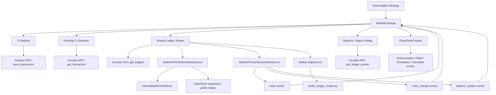
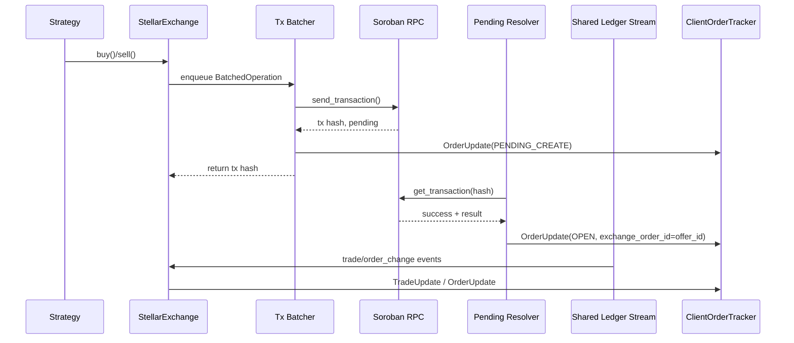
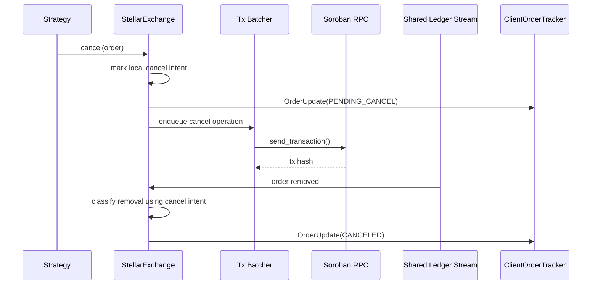

# Stellar Connector Technical Documentation

This document describes the internal architecture of the Stellar connector, how the main components interact, and the most important implementation details to understand before modifying the code.

## Overview

The Stellar connector is a spot connector for the Stellar native DEX built on top of Hummingbot's `ExchangePyBase`.

Key design choices:

- **Soroban RPC only**
- **No Horizon**
- **Ledger-driven market data and user events**
- **Background transaction confirmation**
- **Transaction batching**
- **Channel accounts for concurrent submission**
- **Shared ledger polling for public and private event consumers**

At a high level:

- `stellar_exchange.py` owns connector state and trading behavior
- `stellar_ledger_stream.py` is the single poller of `get_ledgers()`
- `stellar_ledger_reader.py` converts `LedgerCloseMeta` into domain-level order/trade changes
- the order book and user stream data sources consume the shared ledger stream
- order placement and cancelation are asynchronous and resolved after ledger/transaction confirmation

## Architecture Diagram



## Module Structure

### `stellar_exchange.py`

Main connector implementation.

Responsibilities:

- connector lifecycle
- trading pair setup
- order placement
- cancelation
- transaction batching
- background transaction confirmation
- user-event processing
- balance/status fallback polling
- mapping offer IDs to client order IDs

This is the orchestration layer.

### `stellar_ledger_stream.py`

Shared ledger polling service.

Responsibilities:

- poll `get_ledgers()` once for all consumers
- decode `LedgerCloseMeta`
- derive a normalized `StellarLedgerEvent`
- fan the event out to internal subscribers via `asyncio.Queue`

This avoids duplicated RPC polling and duplicated XDR parsing.

### `stellar_ledger_reader.py`

Domain translation layer for Stellar ledger metadata.

Responsibilities:

- walk `LedgerCloseMeta`
- flatten ledger entry changes into domain changes
- derive:
  - `StellarOrderCreated`
  - `StellarOrderUpdated`
  - `StellarOrderRemoved`
  - trade records
- maintain `InternalStellarOrderBook`

This file is the core of ledger interpretation.

### `stellar_api_order_book_data_source.py`

Public market data consumer.

Responsibilities:

- subscribe to the shared ledger stream
- update local order book state
- emit public trade messages
- generate periodic snapshots from local state

The connector currently uses snapshots rather than diff messages for the order book feed.

### `stellar_api_user_stream_data_source.py`

Private event consumer.

Responsibilities:

- subscribe to the shared ledger stream
- filter events for:
  - main account
  - channel accounts
- emit:
  - `trade`
  - `order_change`
  - `balance_update`

Trade events are emitted before order-change events so fills are processed before terminal status transitions.

### `stellar_utils.py`

Utility and config layer.

Responsibilities:

- connector config schema
- `StellarMarket`
- channel account pool
- trading pair / asset conversion helpers

### `stellar_constants.py`

Constants and market defaults.

Responsibilities:

- RPC defaults
- polling intervals
- reserve/fee constants
- default market definitions

### `stellar_auth.py`

Authentication helper for the main Stellar keypair.

### `stellar_order_book.py`

Transforms internal order/trade payloads into Hummingbot order book messages.

### `stellar_web_utils.py`

Minimal compatibility layer for `ExchangePyBase`.

## Runtime Data Flow

## 1. Public and Private Ledger Consumption

The connector uses a single ledger stream:

1. `StellarLedgerStream` polls `get_ledgers()`
2. each ledger is decoded into `LedgerCloseMeta`
3. `stellar_ledger_reader.py` extracts:
   - order changes
   - trades
   - close time
4. the stream broadcasts one `StellarLedgerEvent` to all subscribers
5. subscribers process the same logical ledger independently

Consumers:

- `StellarAPIOrderBookDataSource`
- `StellarAPIUserStreamDataSource`

This ensures consistent sequencing between public and private processing.

## 2. Order Placement Flow

Order placement is intentionally asynchronous.

### Sequence

1. strategy submits buy/sell
2. `StellarExchange._place_order()` creates a `BatchedOperation`
3. the operation enters the batch queue
4. `_tx_batcher_loop()` collects operations for `TX_BATCH_WAIT_MS`
5. the connector builds a single Stellar transaction with up to `TX_MAX_OPERATIONS`
6. transaction source is a channel account
7. offer operation source is the main trading account
8. `send_transaction()` returns a transaction hash
9. the order is marked `PENDING_CREATE`
10. `_pending_order_resolver_loop()` polls `get_transaction()`
11. once confirmed, the offer ID is extracted and the order becomes `OPEN`

### Why it works this way

Stellar sequence numbers are per account. Using channel accounts lets the connector submit multiple transactions concurrently without sequence contention on the main account.

## 3. Transaction Batching

The connector can batch multiple operations into one transaction.

Current behavior:

- waits `100ms` for more operations
- batches up to `100` operations into one transaction
- supports both order creates and cancels in the batching pipeline

Benefits:

- lower network overhead
- fewer ledger submissions
- better throughput under bursty strategy behavior

Important implementation detail:

- each `PendingTransaction` tracks multiple client order IDs in operation order
- result parsing must preserve operation order so offer IDs map back to the correct client orders

## 4. Pending Transaction Resolution

The connector does not block until a transaction is fully confirmed.

Instead:

- order placement returns after submission
- transaction hash is temporarily used as the exchange order identifier while pending
- a background resolver checks `get_transaction()`
- on success:
  - the real Stellar offer ID replaces the temporary hash
  - the order becomes `OPEN`
- on timeout or failure:
  - affected orders are moved to failure states

This keeps order placement responsive while still reconciling the actual ledger result.

## 5. User Event Processing

The user stream data source emits three logical event types:

- `trade`
- `order_change`
- `balance_update`

### Why trade events come first

The `ClientOrderTracker` waits for fill updates before final completion.

If an order is marked `FILLED` before the corresponding trade update arrives, Hummingbot logs:

```text
The order fill updates did not arrive on time...
```

To avoid that:

- user trade events are emitted before order-change events
- `stellar_exchange.py` processes `trade` events explicitly
- `StellarOrderRemoved` is no longer used as the primary source of synthetic fills in the normal flow

## 6. Cancelation Classification

Cancelation handling has an important subtlety.

Originally, a removed offer was treated as canceled only if the tracked order state was already `PENDING_CANCEL`.

That was unsafe because:

- `process_order_update(PENDING_CANCEL)` is asynchronous
- a ledger removal event can arrive before local state finishes transitioning
- the connector could misclassify a canceled order as `FILLED`

Current behavior:

- local cancel intent is tracked explicitly
- removal/status logic checks cancel intent, not just current order state
- cancel markers are cleared when the order is definitively resolved

This prevents canceled orders from being mistaken for fills during async races.

## 7. Fallback Status Path

The connector still has a backup polling path using ledger entry lookups.

Primary path:

- shared ledger stream
- user event processing

Backup path:

- `_request_order_status()`
- `get_ledger_entries()` for the current offer

Interpretation:

- offer exists -> `OPEN`
- offer missing and cancel intent exists -> `CANCELED`
- offer missing and no cancel intent -> `FILLED`

If the fallback path detects a fill with remaining quantity not yet recorded, it can synthesize the final fill as a last resort.

## 8. Order Book Model

`InternalStellarOrderBook` stores offers keyed by offer ID.

Important behavior:

- orders are normalized to the tracked pair orientation
- buy-side offers may require price inversion depending on how Stellar represents the offer relative to the tracked pair
- snapshots are built from this local in-memory state

This avoids requiring a separate centralized order book API.

## 9. Account Model

### Main account

Used for:

- balances
- trustlines
- offer ownership
- trading identity

### Channel accounts

Used for:

- transaction source account
- independent sequence numbers
- parallel submission

This separation is central to the connector design.

## 10. Main State Containers

Inside `StellarExchange`, the important state includes:

- `_all_markets`
- `_offer_id_to_order_id`
- `_pending_transactions`
- `_batch_queue`
- `_ledger_stream`
- `_cancel_requested_order_ids`
- `_cancel_requested_offer_ids`

These are the main structures to inspect when debugging.

## Core Classes and Data Models

### `BatchedOperation`

Represents one queued create/cancel request before batching.

### `PendingTransaction`

Represents one submitted transaction still awaiting confirmation.

Tracks:

- tx hash
- client order IDs
- trading pairs
- channel account
- cancel metadata

### `StellarLedgerEvent`

Normalized ledger payload shared across consumers.

Contains:

- ledger sequence
- close time
- raw meta
- flattened entry changes
- order changes
- trades

## Sequence Diagram: Create Order



## Sequence Diagram: Cancel Order



## Technical Constraints and Caveats

## Network

- currently uses `Network.PUBLIC_NETWORK_PASSPHRASE`
- setup documentation assumes public network / mainnet configuration

## RPC Dependence

- the connector depends heavily on reliable `get_ledgers()`, `get_transaction()`, and `get_ledger_entries()` behavior
- poor RPC performance can affect:
  - confirmation latency
  - order book freshness
  - balance/status fallback behavior

## Trade Attribution

Trade attribution is ledger-derived, not exchange-pushed.

That means correctness depends on the shape of ledger entry changes and the assumptions in `stellar_ledger_reader.py`.

## Test Surface

The connector has focused unit coverage for:

- ledger stream fan-out
- data source behavior
- ledger reader behavior
- exchange event handling

Some broader exchange tests may still be limited in certain local environments because of unrelated baseline Cython import issues outside this connector.

## Recommended Extension Points

If you extend this connector, the safest places are:

- `stellar_constants.py` for market defaults and timing constants
- `stellar_ledger_reader.py` for better trade/order derivation
- `stellar_ledger_stream.py` for stream enhancements
- `stellar_exchange.py` for order lifecycle and transaction management

If you add new ledger consumers, prefer subscribing to `StellarLedgerStream` instead of creating another RPC polling path.

## Debugging Tips

When debugging runtime issues, inspect these areas first:

### Orders stuck in pending

- `_pending_transactions`
- `_pending_order_resolver_loop()`
- `get_transaction()` responses

### Wrong order classification

- `_process_order_change_event()`
- `_request_order_status()`
- cancel-intent tracking sets

### Missing trades or fill warnings

- user stream trade ordering
- `trade` event processing in `stellar_exchange.py`
- `stellar_ledger_reader.py` trade extraction

### Order book inconsistencies

- `InternalStellarOrderBook`
- pair asset resolution in `trading_pair_to_assets()`
- price inversion logic

## Related Files

- Setup guide: `README.md`
- Main connector: `stellar_exchange.py`
- Shared poller: `stellar_ledger_stream.py`
- Ledger parser: `stellar_ledger_reader.py`
- Public data source: `stellar_api_order_book_data_source.py`
- User stream data source: `stellar_api_user_stream_data_source.py`
- Config and markets: `stellar_utils.py`, `stellar_constants.py`
